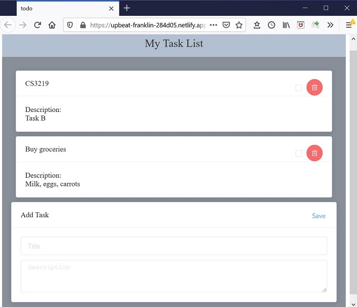
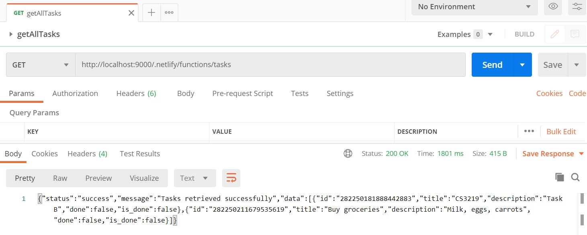
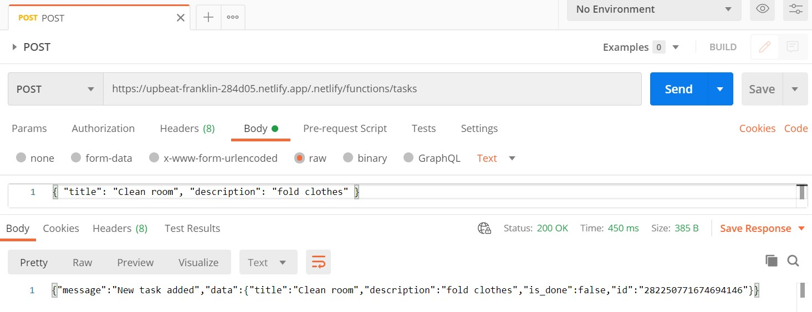

# CS3210 OTOT Assignment Task B
A simple todo list app, access at https://upbeat-franklin-284d05.netlify.app/    



> Frontend: Vue  
Backend: Netlify functions (serverless) & Faunadb  

>Note: local & deployed servers will connect to the same database at Faunadb

## Running the backend API locally
### Setup
Prerequisites: Node 12  

Run the netlify functions locally on port 9000:
```
npm install
npm run serve
```
## Accessing API using Postman

|| serverUrl|
| ------ | ------- |
| Local | http://localhost:9000 |
| Deployed | https://upbeat-franklin-284d05.netlify.app |

| Method | Request Url | Body (select "raw" in Postman) |
| ------------- | ------------- | ------------ | 
| GET  | {serverUrl}/.netlify/functions/tasks  ||
| GET  | {serverUrl}/.netlify/functions/tasks/:id  |  |
| POST | {serverUrl}/.netlify/functions/tasks  | { "title": "Clean room", "description": "fold clothes" } |
| PUT  | {serverUrl}/.netlify/functions/tasks/:id  | { "is_done": true } |
| DELETE | {serverUrl}/.netlify/functions/tasks/:id  |  |
<p></p>


<p>Screenshot: sending a GET request to the local server</p>
  
<p>Screenshot: sending a POST request to the deployed server</p>



## Testing
(1) To test handler functions directly, no API calls to local server:
```
npm run test:local
```
(2) To test by making API calls to local server:
```
npm run test:local-server
```
(3) To test by making API calls to deployed endpoint:
```
npm run test:deployed
```
Automated testing using Travis CI:  
(Note that only (1) and (2) mentioned above are run by travis)  
TODO screenshot


## Frontend (local only)
Prerequisites:  Vue CLI
Run: 
```
cd frontend/task/ 
npm install
npm run serve
```


## References
https://epsagon.com/development/how-to-test-serverless-apps/
https://nordschool.com/build-a-serverless-database-using-faunadb-and-netlify-functions/
https://github.com/netlify/netlify-faunadb-example
https://www.digitalocean.com/community/tutorials/test-a-node-restful-api-with-mocha-and-chai#mocha-testing-environment
...and more...

